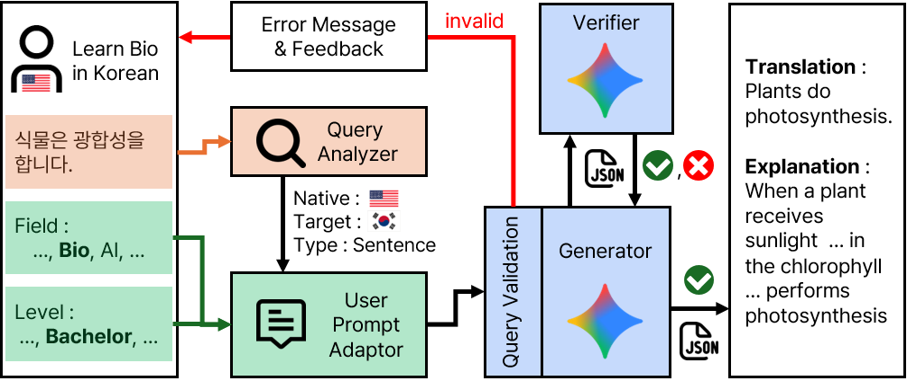

# AdapDict  
**A Level- and Domain-Adaptive Educational Dictionary and Encyclopedia System**

This repository contains the **reference implementation** of *AdapDict*, a level- and domain-adaptive educational dictionary and encyclopedia system proposed in our System Demonstration paper.

AdapDict is designed to generate **structured, level-controlled, and domain-aware explanations** for words, sentences, and paragraphs, supporting comprehension-oriented learning in foreign-language and specialized-domain settings.

- Live Demo: https://adapdict.onrender.com/
- Demo Video: https://www.youtube.com/watch?v=NwH8MK9qJk4

---

## Repository Scope

This repository provides:
- the **end-to-end system pipeline** described in the paper,
- predefined prompt templates used for level- and domain-controlled generation,
- structured output schemas for dictionary and encyclopedia modes,
- a generator–verifier loop for hallucination reduction.

This repository is intended for **system understanding, reproducibility, and research extension** as a research reference implementation, and is not intended for production deployment or direct reuse as an API or SDK.

---

## System Overview



AdapDict operates as a multi-stage pipeline rather than a single LLM call.

### Pipeline Components

1. **Query Analyzer**  
    - Identifies input type: *word*, *sentence*, or *paragraph*.  
    - Detects input language.
    - Applied **only in Dictionary mode**, where output schemas vary by input granularity.

2. **User Prompt Adaptor**  
    - Constructs structured prompts conditioned on:
        - learner level,
        - field of study,
        - mode (Dictionary / Encyclopedia),
        - language direction (native → target, target → native, native→native).
    - Difficulty control is implemented along five explanatory axes: vocabulary, sentence structure, explanation depth, abstraction, and use of examples.

3. **Query Validation**  
    - Filters invalid or problematic inputs before generation.
    - Classifies queries into: VALID, TYPO, FACTUAL ERROR, AMBIGUOUS, NONSENSE.
    - Only VALID queries proceed to generation.

4. **Generator**  
    - Produces structured outputs using an LLM (Gemini).
    - All outputs strictly follow predefined JSON schemas depending on mode and input type.

5. **Verifier**  
    - Evaluates generated outputs for:
        - translation errors,
        - semantic misinterpretation,
        - factual hallucination,
        - contextual distortion.
    - Triggers regeneration with corrective feedback when hallucinations are detected.

---

## Modes and Output Structures

### Dictionary Mode
- Supports word-, sentence-, and paragraph-level inputs.
- Outputs include translations, explanations, examples, and domain-specific sense disambiguation.
- Output structure varies by input type and is explicitly defined via JSON schemas.

### Encyclopedia Mode
- Operates in native→native language settings.
- Produces conceptual explanations, background knowledge, and key-term extraction.
- Output structure is independent of input length.

All outputs are **level-adjusted**, **domain-aware**, and **schema-constrained**.

---

## Setup & Minimal Execution Example

We recommend using a Conda virtual environment.

```bash
conda create -n adapdict python=3.11
conda activate adapdict
pip install -r requirements.txt
```

The system requires a personal Gemini API key.

Create a `.env` file and add the following entry:
```text
GOOGLE_API_KEY=<your-google-api-key>
```

The system can be launched locally as a minimal web-based demonstration.

```bash
python backend/main.py
```

After the server starts, open the following URL in your browser:

```
http://127.0.0.1:5001/
```
This launches the full end-to-end pipeline described in the paper and allows inspection of the system behavior via the local web interface.
